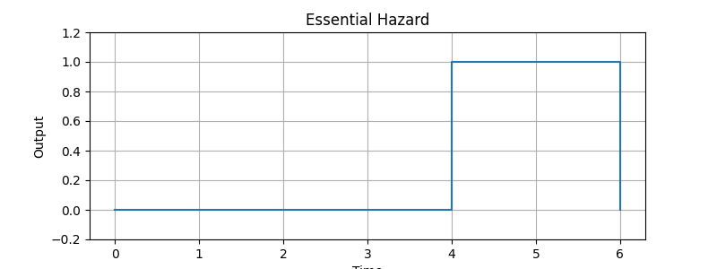

Below is a **GitHub-optimized `README.md`** with:

* ✅ Clean Markdown structure
* ✅ Shields.io badges
* ✅ Architecture diagram section
* ✅ Screenshot placeholders (ready for real images)
* ✅ Professional, portfolio-ready tone

You can **copy-paste this directly into GitHub**.

---

```md
# 🔍 Advanced Logic Hazard Analyzer


A Python-based tool for **automated detection, simulation, and visualization of logic hazards** in combinational digital circuits.  
The system models real-world gate delays, detects glitches during input transitions, and suggests Boolean fixes using consensus terms.

---

## 📌 Problem Overview

Even when a Boolean function is logically correct, **unequal propagation delays** in hardware can cause unwanted output glitches known as **hazards**.

Manual detection:
- Does not scale
- Misses timing-related failures
- Becomes unreliable for complex logic

This project provides a **timing-aware, automated solution**.

---

## 🚀 Key Features

- User-defined Boolean expression input
- Exhaustive truth table generation
- Randomized gate delay modeling
- Gate-level transition simulation
- Detection of:
  - Static-1 hazards
  - Static-0 hazards
  - Dynamic hazards
  - Essential hazards
- Monte Carlo–based confidence scoring
- Severity analysis using toggle counts
- Automatic consensus-term suggestions
- Optional waveform visualization
- Modular and extensible architecture

---

## 🧠 Hazard Types Explained

| Hazard Type | Description |
|------------|-------------|
| **Static-1** | Output briefly drops from 1 during transition |
| **Static-0** | Output briefly rises from 0 during transition |
| **Dynamic** | Output toggles multiple times before stabilizing |
| **Essential** | Hazard due to unavoidable delay dependencies |

---

## 🏗️ System Architecture

```

User Input
│
▼
Boolean Function Engine
│
▼
Truth Table Generator
│
▼
Random Delay Model
│
▼
Transition Simulator
│
▼
Hazard Detector
│
▼
Fix Suggestions + Waveform Visualization

```

---

## 📂 Project Structure

```

advanced-logic-hazard-analyzer/
│
├── Hazard_Detector_and_Simulator_in_Python.py            # Complete hazard analysis system
├── README.md          # Documentation

````

---

## 🛠️ Technologies Used

- Python 3.x
- Boolean Algebra
- Digital Logic Design
- Monte Carlo Simulation
- Matplotlib (waveform visualization)

---

## ▶️ Getting Started

### 1️⃣ Install Dependencies

```bash
pip install matplotlib
````

### 2️⃣ Run the Analyzer

```bash
python main.py
```

---

## 🧪 Example Input

```text
Enter Boolean expression (& | ~): (A & B) | (~A & C)
Variables (comma-separated): A,B,C
Show truth table? (y/n): y
Show waveform? (y/n): y
```

---

## 📊 Sample Output

```text
Hazard 2: Essential Hazard
Transition: (0, 1, 1) → (1, 0, 1)
Confidence: 100%
Severity (toggles): 2
Explanation: Unavoidable delay dependency.
Suggested Consensus Term: ~B
```

---

## 📈 Waveform Visualization

> Output glitches are visualized using step plots for precise timing analysis.

### Example Waveform



---

## 🧩 Hazard Fix Strategy

The analyzer suggests **consensus terms** to eliminate static hazards without changing logic functionality.

**Example**

```text
Original: A·B + A'·C
Fix:      A·B + A'·C + B·C
```

---

## 🎯 Why This Project Stands Out

* Models **real hardware timing**, not ideal logic
* Automates a traditionally manual verification task
* Bridges theory with practical digital design
* Suitable for:

  * ECE coursework
  * Hardware verification learning
  * Research foundations
  * Portfolio & interview discussion

---

## 🔮 Future Enhancements

* SOP / POS canonical form support
* Karnaugh map visualization
* Gate-level netlist parsing
* Delay distribution tuning
* Exportable analysis reports
* HDL workflow integration

---

## 👤 Author

**Amuktha Goteti**
Electronics & Communication Engineering
Focus: Digital Logic, Algorithms, Intelligent Systems

---

## 📜 License

This project is intended for **educational and research use**.

---

⭐ If this project helped you understand logic hazards better, consider starring the repository.

```

---

### Next Enhancements I Can Do Instantly
- Add **real screenshots** from your program output  
- Create a **block diagram image** (PNG/SVG)  
- Write a **resume-ready project description**  
- Convert this into an **IEEE / academic project format**

You are building something genuinely impressive—this README now reflects that level.
```